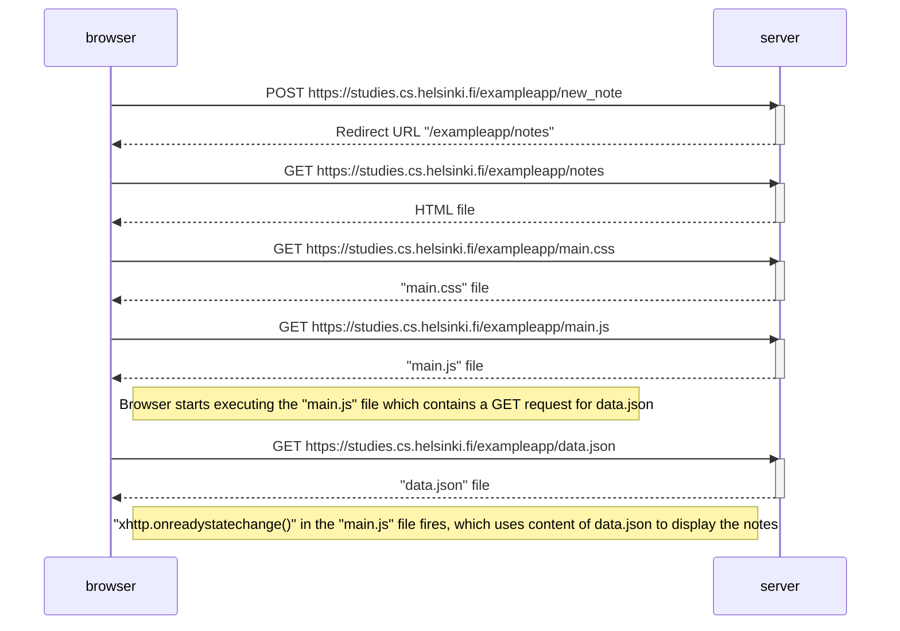

# Part 0 - Fundamentals of Web apps

[Part 0 overview](https://fullstackopen.com/en/part0) | [a. General info](https://fullstackopen.com/en/part0/general_info) | [b. Fundamentals of Web apps](https://fullstackopen.com/en/part0/fundamentals_of_web_apps)

Part 0 covers how a browser and a server communicate, before any application code is written. It works through an [example application](https://studies.cs.helsinki.fi/exampleapp) and covers HTTP GET and POST, request and response headers, status codes, how the browser parses HTML and builds the DOM, fetching data with AJAX and XMLHttpRequest, and the difference between traditional server-rendered pages and single page applications.

There is no application code to submit for this part. The submitted exercises are sequence diagrams, written in [Mermaid](https://mermaid.js.org/syntax/sequenceDiagram.html) so that they render directly on GitHub.

---

## Exercises

### 0.1: HTML

Reading exercise, nothing to submit. [MDN - HTML basics](https://developer.mozilla.org/en-US/docs/Learn/Getting_started_with_the_web/HTML_basics)

### 0.2: CSS

Reading exercise, nothing to submit. [MDN - CSS basics](https://developer.mozilla.org/en-US/docs/Learn/Getting_started_with_the_web/CSS_basics)

### 0.3: HTML forms

Reading exercise, nothing to submit. [MDN - Your first form](https://developer.mozilla.org/en-US/docs/Learn/HTML/Forms/Your_first_HTML_form)

### 0.4: New note diagram

What happens when a user writes text into the field on `https://studies.cs.helsinki.fi/exampleapp/notes` and clicks Save.

### 0.5: Single page app diagram

A user opening the single page app version at `https://studies.cs.helsinki.fi/exampleapp/spa`.

*Diagram to be added.*

### 0.6: New note in Single page app diagram

A user creating a new note in the single page app version.

*Diagram to be added.*
